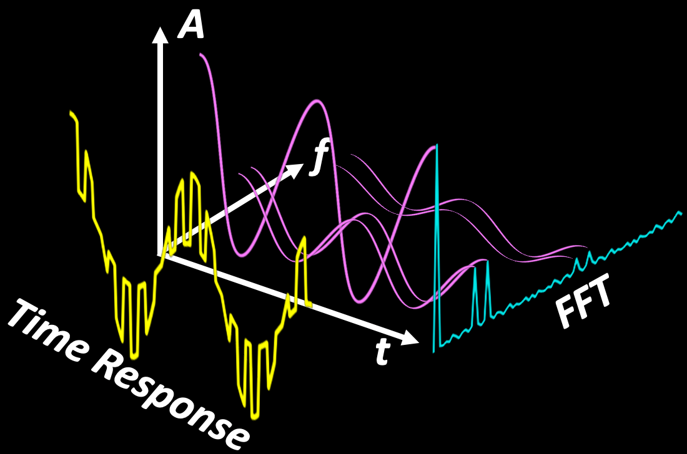
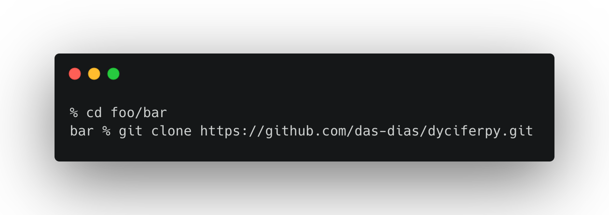
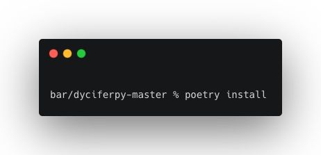
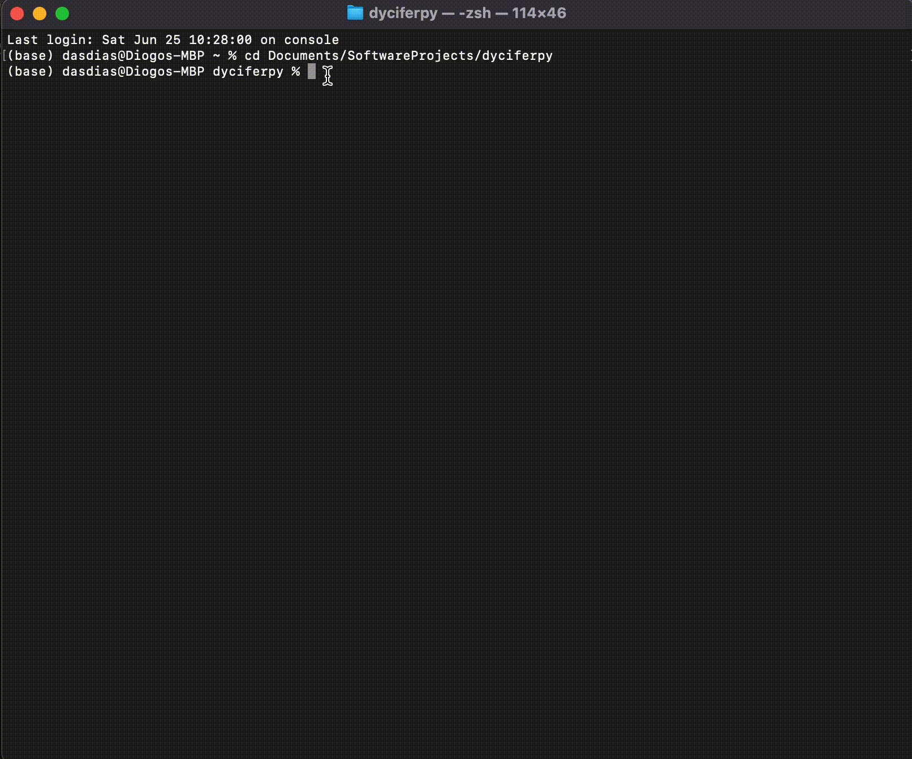
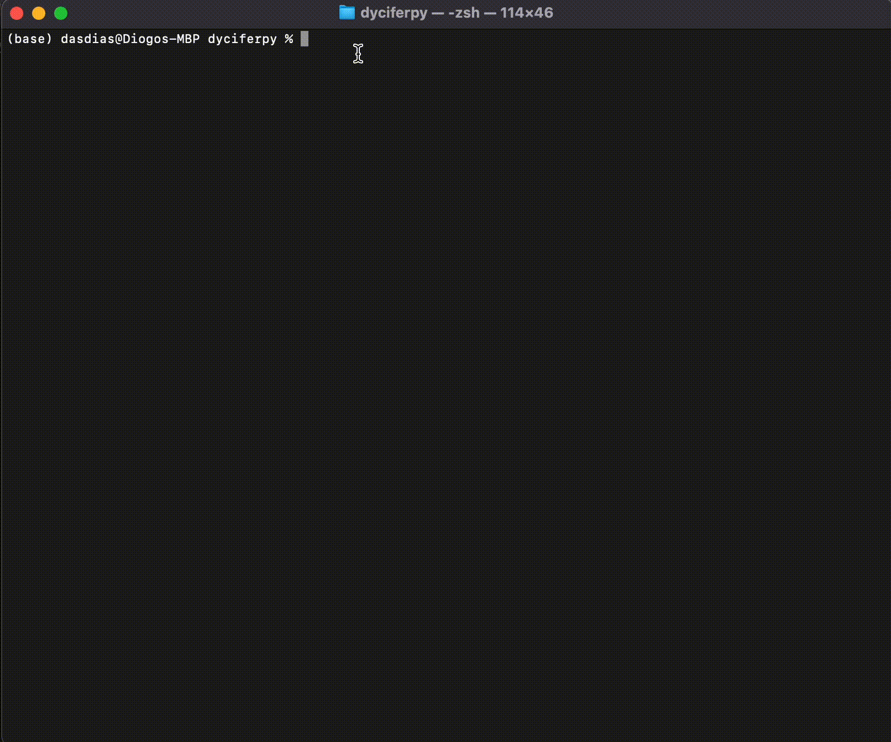

|GitHub Workflow Status| |GitHub| |GitHub issues| |GitHub package.json
version (branch)| |GitHub last commit|

``Dynamic Circuit Performance Evaluation Tool (DYCIFER)``

is a tool written in ``Python`` that allows for the extraction of the
Performance Indicators of Dynamic Integrated Circuits. Through the
analysis of each system’s signals (both input and output), the tool will
be able to extract indicators such as the *Total Harmonic Distortion*
(THD) or *Signal to Noise & Distortion Ratio* (SNDR) of dynamic
integrated circuit.

How does it work
----------------

Any integrated circuit designer can simulate the time response of an
implemented system through a *Transient Analysis*, which is a basic
concept of Electric Circuits Theory. The exported data to Comma
Separated Values files (.CSV) can be parsed as input to the tool. In the
examples provided, ®Cadence Virtuoso’s time response simulator was used
to obtain some of the time response data.

   fft-algo

From the simulated time response data of the system we want to analyze,
the `Fast Fourier Transform (FFT) <URL>`__ (core) algorithm is used to
enable the extraction of all the *Dynamic Circuit Performance
Indicators* listed in the table below. From these indicators, an
integrated circuit designer can eccurately measure the performance of
the designed system.

+-----------------------------------+-----------------------------------+
| Performance Indicator             | Description                       |
+===================================+===================================+
| `Signal                           | Power of the analysed signal      |
| S                                 |                                   |
| trength <./docs/indicators.md>`__ |                                   |
+-----------------------------------+-----------------------------------+
| `DC Signal                        | Power of the DC component of the  |
| S                                 | analysed signal                   |
| trength <./docs/indicators.md>`__ |                                   |
+-----------------------------------+-----------------------------------+
| `ENOB <./docs/enob.md>`__         | Effective Number of Bits          |
+-----------------------------------+-----------------------------------+
| `SFDR <./docs/indicators.md>`__   | Spurious Free Dynamic Range       |
+-----------------------------------+-----------------------------------+
| `SNR <./docs/indicators.md>`__    | Signal to Noise Ratio             |
+-----------------------------------+-----------------------------------+
| `THD <./docs/indicators.md>`__    | Total Harmonic Distortion         |
+-----------------------------------+-----------------------------------+
| `SNDR <./docs/indicators.md>`__   | Signal to Noise & Distortion      |
|                                   | Ratio                             |
+-----------------------------------+-----------------------------------+
| `HD2 <./docs/indicators.md>`__    | 2nd Order Harmonic Distortion     |
|                                   | Ratio                             |
+-----------------------------------+-----------------------------------+
| `HD3 <./docs/indicators.md>`__    | 3rd Order Harmonic Distortion     |
|                                   | Ratio                             |
+-----------------------------------+-----------------------------------+
| `Gain <./docs/indicators.md>`__   | Power Ratio between the Output    |
|                                   | and Input signals                 |
+-----------------------------------+-----------------------------------+
| `Rise Time                        | The total time it takes the       |
| [90%] <./docs/rise-time.md>`__    | signal to rise from 10% up to 90% |
|                                   | of its total amplitude - only     |
|                                   | important in pulse responses or   |
|                                   | pulse modulated signals.          |
+-----------------------------------+-----------------------------------+
|                                   |                                   |
+-----------------------------------+-----------------------------------+

Dependencies
------------

-  `Poetry <URL>`__ - ``Poetry`` is the default ®Python package manager,
   and it allows to easily deploy and install any project or package
   written in Python language.

Other `package dependencies <./docs/dependencies.md>`__

Installation
------------

| It is highly recommended to use ``Poetry`` in order to install
  ``DYCIFER`` because it will automatically setup the virtual
  environment and package dependencies necessary to run this tool.
| First of all, ``git-clone`` this repository into a directory:

   git-clone

::

   git clone https://github.com/das-dias/dyciferpy.git

Alternatively, you can `download <URL>`__ this repo’s ``.zip`` file and
extract it into a personal directory, if you don’t have `git <URL>`__
installed in your machine.

Next, using ``Poetry``, inside the downloaded repository directory, run
the installation command:

   poetry-install

::

   poetry install

Usage
-----

Asking for help
~~~~~~~~~~~~~~~

::

   poetry run dycifer | -h | --help

   General Help

``DYCIFER`` is a tool designed to run on the console, and as such it
features a neat-looking *Command Line Interface* (CLI) that allows for
an easy interaction with its sub-frameworks:

-  Mixed-signals Integrated Circuits dedicated framework
-  Analog Integrated Circuits dedicated framework

Mixed Signals Integrated Circuit Performance Analysis
~~~~~~~~~~~~~~~~~~~~~~~~~~~~~~~~~~~~~~~~~~~~~~~~~~~~~

::

   poetry run dycifer mixedsignals | -h | --help

   Mixed-Signals Help

This sub-framework is mainly dedicated to provide automated performance
analysis to the following systems:

-  Analog-to-Digital Converters (ADC) (considering parallel output bit
   lines)
-  Digital-to-Analog Converters (DAC) (NOT IMPLEMENTED YET)
-  :math:`\Sigma \Delta` (Sigma-Delta) ADC (considering serial `Pulse
   Width Modulated <URL>`__ output signal line) (NOT IMPLEMENTED YET)
-  :math:`\Sigma \Delta` DAC (NOT IMPLEMENTED YET)

Analog Integrated Circuit Performance Analysis
~~~~~~~~~~~~~~~~~~~~~~~~~~~~~~~~~~~~~~~~~~~~~~

::

   poetry run dycifer analog | -h | --help

   Analog Help

This sub-framework provides coverage to two classes of analog integrated
systems:

-  Continuous Amplitude Output Systems (CAOS)
-  Discrete Amplitude Output Systems (DAOS)

The discrimination of analog systems in these two classes provide for
powerful, simplified methods to retrieve the performance indicators of
(e.g.)

-  Transient responses resembling square (or pulse) waves, or pulse
   modulated sinusoidal waves, regarding DAOS systems

-  Sinusoidal waves (impure/distorted/noisy or pure), regarding CAOS
   systems

Examples
--------

Detailed examples on the usage of this tool can be found in the
following documents:

**Performance Analysis** - `ADC Performance
Analysis <./docs/adc-example.md>`__ - `CAOS Amplifier Performance
Analysis <./docs/caos-amplifier-example.md>`__ - `DAOS Amplifier
Performance Analysis <./docs/daos-amplifier-example.md>`__

**Saving Images and Performance Indicators** - `Saving
Tables <./docs/saving-tables.md>`__ - `Saving
Images <./docs/saving-images.md>`__

.. |GitHub Workflow Status| image:: https://img.shields.io/github/workflow/status/das-dias/dyciferpy/dycifer
.. |GitHub| image:: https://img.shields.io/github/license/das-dias/dyciferpy
.. |GitHub issues| image:: https://img.shields.io/github/issues/das-dias/dyciferpy
.. |GitHub package.json version (branch)| image:: https://img.shields.io/github/package-json/v/das-dias/dyciferpy/master
.. |GitHub last commit| image:: https://img.shields.io/github/last-commit/das-dias/dyciferpy
