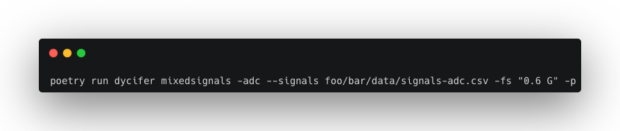
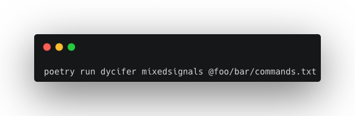

## Example: Analog-to-Digital (ADC) Performance Analysis


This example covers the analysis of a 4-Bit (parallel output) C2C ADC. There are two main options to perform this analysis:
- Parsing the coverted digital words resembling the output signal of the ADC
- Parsing the raw time response of each output signal line for each one of the output Bits. 
  
The latter option will lead to an automatic reconstruction of the output signal of the ADC in the input signal scale, and that is approach exemplified in this document.

Consider the output signals for each bit of the ADC, saved in ```foo/bar/data/signals-adc.csv```:


These signals were directly retrieved from ®Cadence Virtuoso EDA software.\
As you can observe from the terminal snapshot above, the signals data features a time axis. Because it is mandatory to specify the Sampling Frequency (F<sub>S</sub>) considered in the FFT analysis, the time axis is not fundamental, once it can be approximately reconstructed by the time step chosen implicitly by the specification of F<sub>S</sub>.

Now, all that is needed to be done is setup the simulation input data and run the tool.

### Parsing commands from terminal:

The first option is to setup the simulation directly in terminal, writting the commands as arguments to the tool's CLI.



```
poetry run dycifer mixedsignals -[SYSTEM_CLASS] --signals [DATAPATH] -fs [SAMPLING_FREQUENCY] -p
```
Where in this example:
- SYSTEM_CLASS = ```adc```
- DATAPTH = ```foo/bar/data/signals-adc.csv```
- SAMPLING_FREQUENCY = ```"0.6 G"``` or ```0.6e9```

In this case, the ADC's dynamic performance evaluation was performed considering a sampling rate of 0.6 GHz, even though the data was retrieved from Virtuoso @ 2 GHz (2 points from each System's Clock cycle).

The textual results printed to the console terminal have the following aspect:


The ```-p``` argument is a flag to signal the tool to output the resulting signal Spectrum obtained from the FFT algorithm, represented in the image below.


As you can see, the resulting Signal Spectrum plot features the power of the detected fundamental harmonic, @ 39 MHz (the frequency of the converted analog signal), and the frequencies of the chosen set of highlighted harmonics - by default, the first 7 harmonics are considered during analysis.

<span style="color:orange"> Important Note </span>: Off course this sampling rate reduction will cause a greater error in the obtained results, and therefore, the sampling frequency should be kept as close as possible to the sampling frequency of the EDA program that generated the time response data.

### Parsing commands from a text file (.TXT):
The tool's CLI also supports parsing the commands directly from a .TXT file.
Considering a text file with the following content:

```Python
# foo/bar/commands.txt

-adc
-s
foo/bar/data/signals-adc.csv
-fs
0.6 G
-p
```

Then the same results as the ones shown previously can be achieved by executing the following command:



```
poetry run dycifer mixedsignals @[TEXTFILE_PATH]
```
Where in this example's case:
- TEXTFILE_PATH = ```foo/bar/commands.txt```

<span style="color:orange"> Note </span>: This parsing from text file functionality is especially important for the future endeavour of creating a *Graphical User Interface* (GUI) for ```DYCIFER```, allowing to linking the graphical framework to the back-end of the application by means of automatically generated text files that capture the user inputs from the GUI.