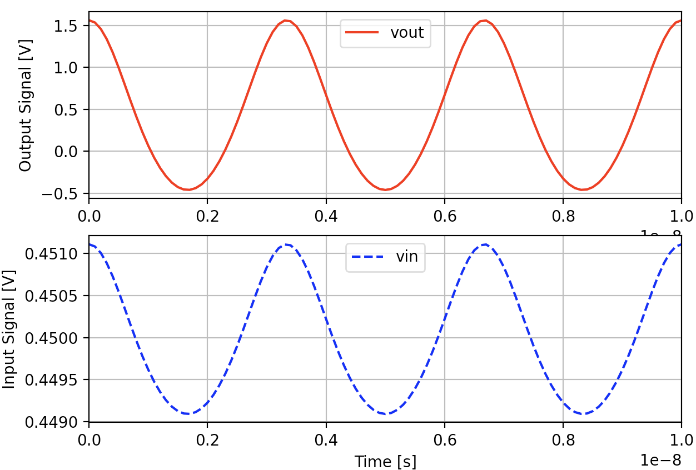
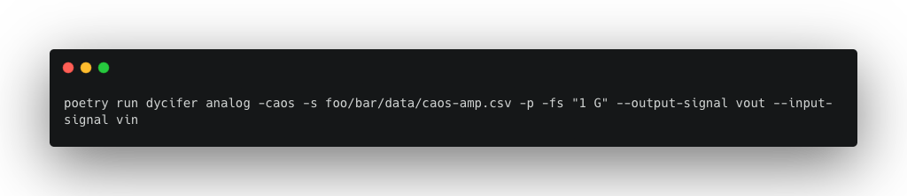
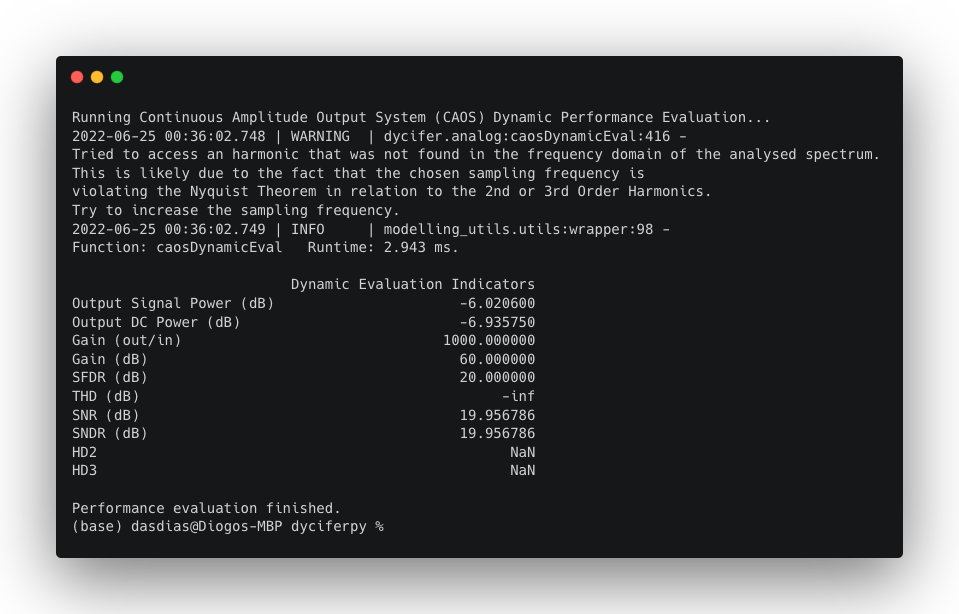
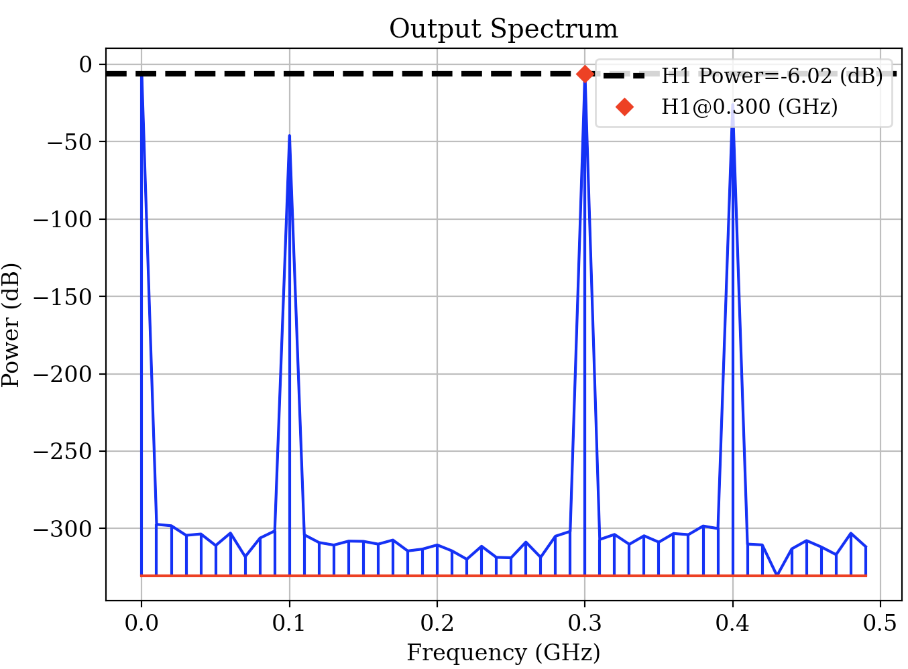
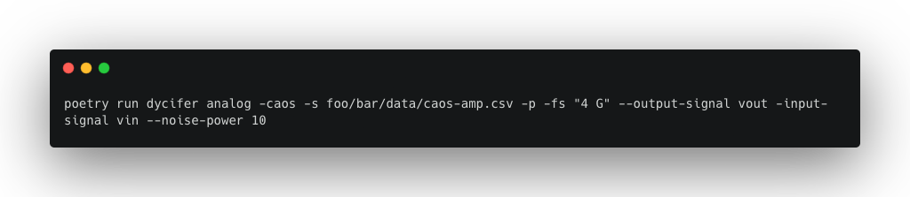
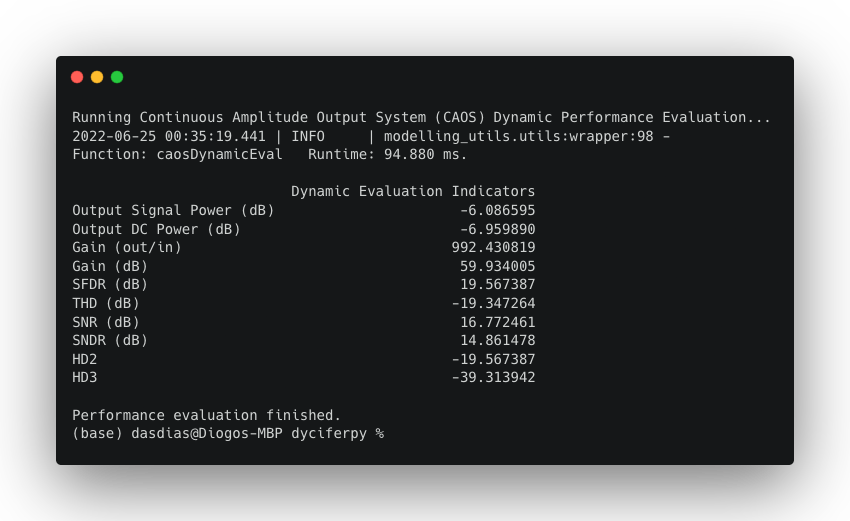
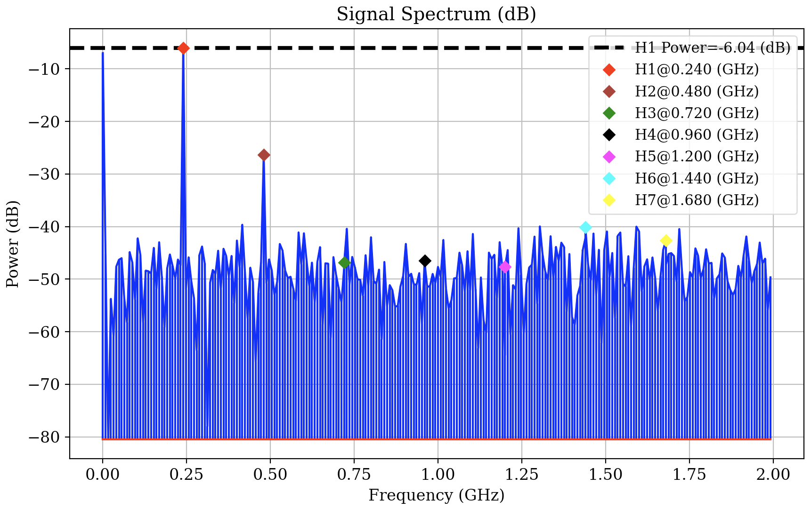

## Example: Standard Amplifier Performance Analysis

This example features a simple continuous amplitude amplifier with a gain of 60 dB (1000 $VV^{-1}$). The considered input and output signals were generated artificially, with a time resolution equivalent to a sampling frequency of 10 GHz. The fundamental frequency of both the input and output of the artificial amplifier is 300 MHz. The aforementioned signals can be seen below.



Considering that the signals represented above are saved in ```foo/bar/data/caos-amp.csv```, the dynamic performance analysis of the described amplifier can be done by running the following command:


```
poetry run dycifer analog -[SYSTEM_CLASS] -s [SIGNALS_DATAPATH] -p -fs [SAMPLING_FREQUENCY] --output-signal [OUTPUT_SIGNAL_NAME] --input-signal [INPUT_SIGNAL_NAME]
```

Where in this case:
- SYSTEM_CLASS = ```caos```
- SIGNALS_DATAPATH = ```foo/bar/data/caos-amp.csv```
- SAMPLING_FREQUENCY = ```1 GHz```
- OUTPUT_SIGNAL_NAME = ```vout``` (as given in the ```caos-amp.csv``` data file)
- INPUT_SIGNAL_NAME = ```vin``` (as given in the ```caos-amp.csv``` data file)


The output of this run will be a "bumpy" one, as expected:



The terminal output of the tool features a warning. This warning tells us that the 2<sup>nd</sup> and 3<sup>rd</sup> Order Harmonics were not possible to access because they're placed outside the maximum frequency value of the frequency axis. \
Because the chosen sampling frequency is 1 GHz, the maximum frequency of the positive frequency axis is 500 MHz, which is lower than the second order harmonic's frequency (600 MHz). The *Total Harmonic Distortion* (THD), 2<sup>nd</sup> and 3<sup>rd</sup> Order Harmonic Distortion indicators, HD2 and HD3 respectively, remain thus undefined.



Let us than run the same analysis with a higher sampling frequency of 4 GHz. Let's also use the parameter ```--noise-power``` to artificially superpose 10 dBm of noise to our output signal:



Agora sim! Every indicator is now correctly defined, and because 10 dBm of noise was added to the output signal during the analysis the output spectrum of this second run features and plot that is filled with a greater number of spurs.




